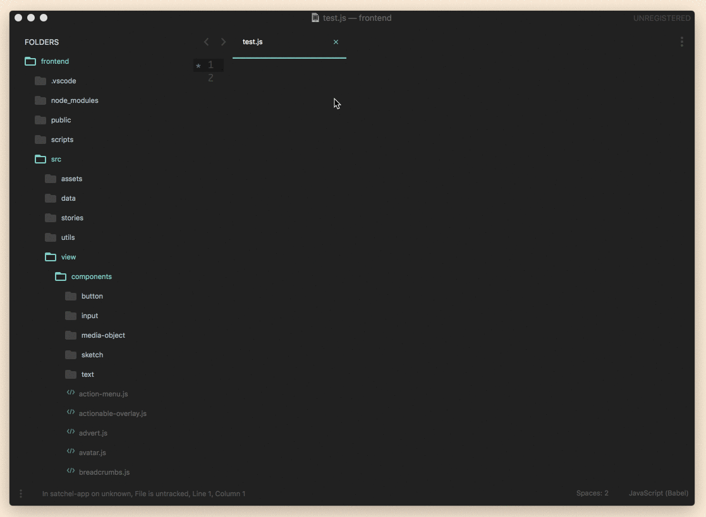

# Sublime Plugin Import Cost

Sublime Text 3 plugin that shows the [import costs](https://github.com/wix/import-cost/) of imported JS modules.



## Install

The best way is to install the plugin via [Package Control](https://packagecontrol.io/), just search for `import cost`. Besides that, you also have to have [`node`](https://nodejs.org/en/) installed, as well as the npm package [`import-cost`](https://github.com/wix/import-cost):

```bash
npm i -g import-cost
```

## Config

To change config options, open the menu `Sublime Text > Preferences > Package Settings > Import Cost` after installing the plugin. The following options are available:

```js
{
  // Check import costs of npm modules when saving a file
  "check_on_save": true,

  // Check import costs when opening a file
  "check_on_open": true,

  // File sizes for differnt warning levels in kb
  "min_size_warning": 40,
  "min_size_error": 100,

  // Path to node binary
  "node_path": "/usr/local/bin/node",

  // File extensions that should be considered
  "extensions": [ "js", "jsx" ],

  // Show gzip size as well
  "show_gzip": false
}
```

## Shoutouts

To [wix](https://github.com/wix/import-cost/) for the awesome npm package, and to [@princemaple](https://github.com/princemaple) for contributing to make this plugin work on Windows as well 🎉

## Todos

 - [x] ~~Add basic menus and settings~~
 - [x] ~~Add "show gzip" option~~
 - [x] ~~Make plugin available through plugin manager~~
 - [x] ~~Make plugin smarter to always find correct node_modules folder, no matter what folder is currently open in sublime~~
 - [ ] Add caching on python level (import-cost has caching itself, but we still have the expensive node bridge thing going on, which is very avoidable)
 - [x] ~~Windows support~~
